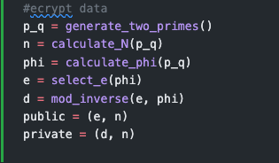
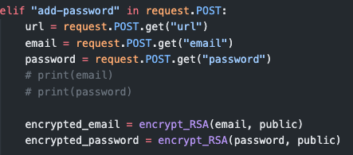
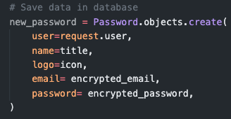
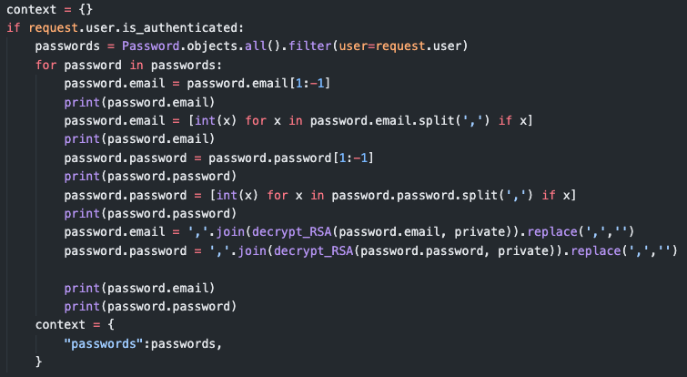
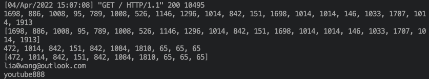
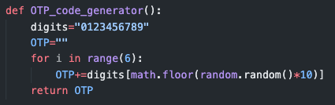
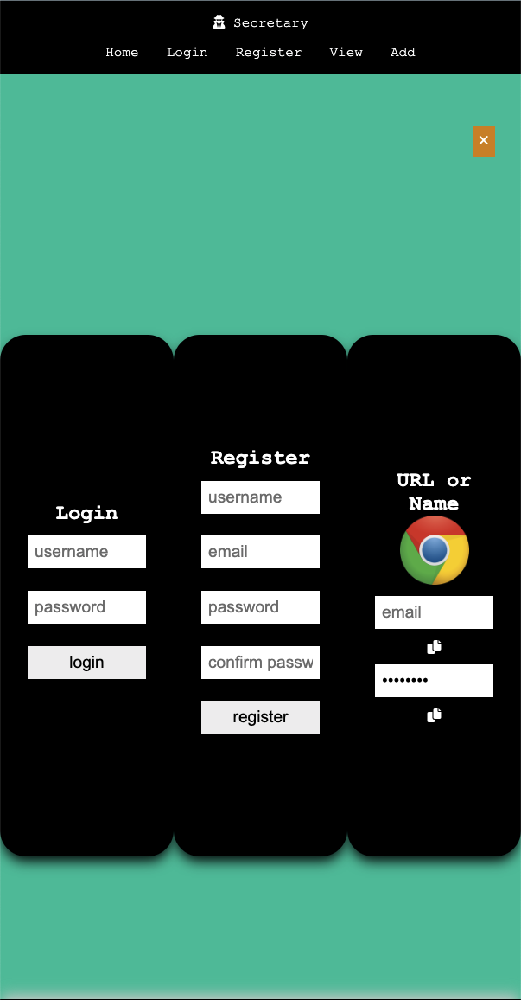

<p align="center"></p>

# Secretary: A web app Password Manager

***my something-awesome-project for COMP6441***

***app link:*** https://secretary-password-manager.herokuapp.com/

***github link:*** https://github.com/lia0wang/Secretary-password-manager

## Ideas

- I want to create a password manager, but terminal interaction is not what I want. What I want is to have a password manager that **everyone can access** it and **interact it with UI**.
- But since I haven't systematically learned html, css and javascript, so I searched some open sources projects and found the most suitable one that inspired me: https://www.youtube.com/watch?v=z87LjWauDvI
- My main purpose is to **implement all the basic functions** of the password manager, and **implement the RSA encryption algorithm in the backend** of the password manager **to encrypt and decrypt user info to enhance the security**. Then at the end **test it through a selenium automation script**.

## Basic Functions

- [x] **UI Design** - People are able to interact with it

- [x] **Security** - Use **RSA** algorithm for the password security

- [x] **Login**
  
  - [x] Return msg when username or password is incorrect
  - [x] Use **OTP** (HOST is outlook) to send confirmation email
    - [x] Return msg when verifitation failed
    - [x] Return msg when verification succeeded

- [x] **Register**
  
  - [x] Return msg when duplicated username
  - [x] Return msg when passwords do not match
  - [x] Return msg when duplicated email
  - [x] Welome msg when register successfully

- [x] **Logout**
  
  - [x] Return msg when loggout

- [x] **Add a new password**
  
  - [x] Use **RSA** algorithm to encrypt the email and password when save them to DB
  - [x] Use **RSA** algorithm to decrypt the encrypt email and password when extract them for view the stored passwords
  - [x] Return msg when add a password succeed
  - [x] For each stored password, find the coresponding website Icon

- [x] **Delete a password**
  
  - [x] Return msg when delete a password succeed

## Challenges I completed

### Backend

- [x] Improve the password security by using **RSA Algorithm**
  
  - [x] Implemented RSA Algorithm, ***source code link:*** https://github.com/lia0wang/Secretary-password-manager/blob/master/Secretary/secretary/rsa.py
  
  - [x] Import it to the backend
    
    - 
  
  - [x] Encrypt the passwrod and email and store the encrypt info into Database
    
    - 
    - 
    - 
  
  - [x] Decrypt them when extracting user info from the Database
    
    - 
  
  - [x] Correct output:
    
    - 
    
    - 
      
      - The 1st two lines are **encrypt email**(I converted the string separated by comma to a list of int).
      - The 2nd two lines are **encrypt password**.
      - The final two lines are **decrypt email and password**
  
  - [x] Implemented **OTP Generator**
  
  - [x] Use **HOST=OUTLOOK** to send OTP
    
    - 
    - 

### Frontend

- [x] Use my own design for the UI

- [x] Update the **script.js** to fix a bug that:
  
  - The bug was when switching modals from one to another, the modal that was open before is not closed, as shown below:
    
    - 
    
    - 

### Testing

- [x] Wrote automation tests using selenium to test the API, ***source code link:*** https://github.com/lia0wang/Secretary-password-manager/blob/master/Tests/test.py
  - [x] Login
    - [x] Enter the wrong user name
    - [x] Enter the wrong password
  - [x] Register
    - [x] Enter different password into the confirmation box
    - [x] Enter invalid email
    - [x] Register the same username and email twice
  - [x] Logout
  - [x] Add a new password
    - [x] Add multiple passwords
    - [x] Examine if the stored password and email are correct
  - [x] Delete a pass word

### Deployment

- [x] Make a deployment on Heroku

## Run it

- First install the requirements packages
  
  ```python
  pip3 install -r requirements.txt
  ```

- Go **something-awesome-project/Secretary/secretary_manager/settings.py**

- And set the DEBUG mode to True
  
  ```python
  # SECURITY WARNING: don't run with debug turned on in production!
  DEBUG = True
  ```

- Go to **something-awesome-project/Secretary/** and run the server
  
  ```python
  python3 manage.py runserver <port>
  ```

- Finally visit the local address
  
  ```python
  http://127.0.0.1:<port>/
  ```

- Note: it is better to use the virtual environment and active it before above steps
  
  ```python
  source venv/bin/activate
  ```
